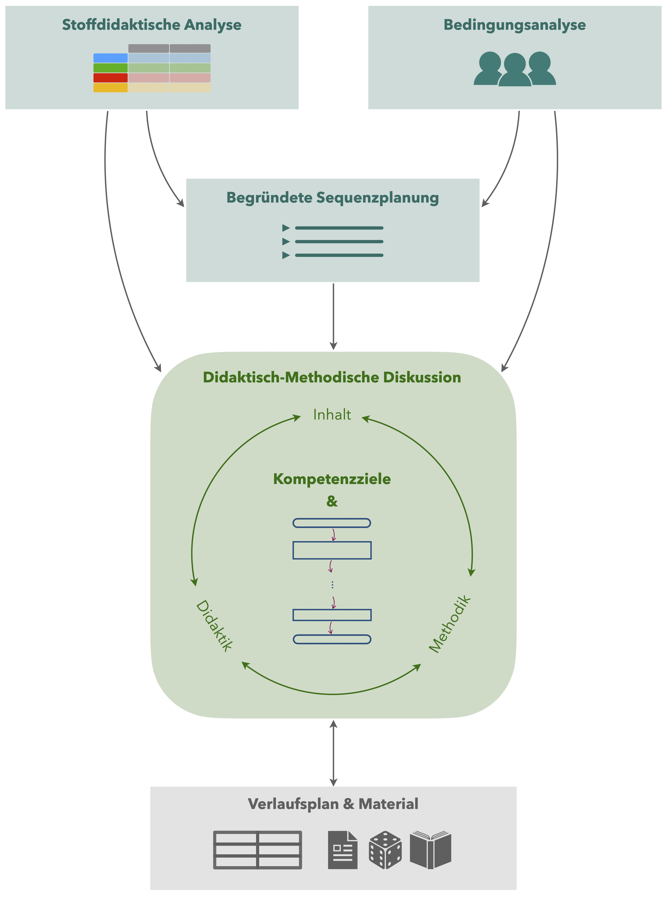

# (PART\*) Allgemeines {.unnumbered}  
  

# Zur Gestaltung der FTP

> **Material** (pdf-Dateien)
>
> + [Ziele der fachdidaktischen Tagespraktika](files/Kompetenzziele.pdf) (siehe Abschnitt \@ref(ziele-der-ftp))
> + [Elemente einer Unterrichtsplanung](files/Unterrichtsplanung-Uebersicht.pdf) (siehe Abschnitt \@ref(elemente-einer-unterrichtsplanung)) 


So wie die Gestaltung von Unterricht an der Schule stark von der jeweiligen Lehrkraft abhängt, ist auch die Gestaltung der fachdidaktischen Tagespraktika von den jeweiligen Dozierenden abhängig.
Dieses Dokument begleitet die bei Dr. Heiko Etzold durchgeführten fachdidaktischen Tagespraktika.
Innerhalb des Praxisteams der Mathematikdidaktik an der Universität Potsdam besteht ein reger Austausch über die Gestaltung der fachdidaktischen Tagespraktika -- insofern ist dieses Dokument zwar im Grundsatz, aber nicht immer im Detail auch auf andere Dozierende übertragbar.
Besonders bedeutsame Abweichungen zum Vorgehen anderer Dozierender werden im Praktikum explizit angesprochen.


## Einordnung und Struktur

Die **fachdidaktischen Tagespraktika (FTP)** sind Bestandteil des Moduls *MAT-LS-D1: Einführung in die Mathematikdidaktik*.
Weitere Lehrveranstaltungen dieses Moduls sind die Vorlesung und die zugehörige Übung (2+2 SWS), in denen verschiedene Lehr-Lern-Theorien, Unterrichtsprinzipien, prozessbezogene Kompetenzen und methodischen Grundlagen des Mathematikunterrichtens besprochen werden.
Das Praktikum findet parallel zur oder im Anschluss an die Vorlesung und damit zum Ende des Bachelorstudiums statt und besteht auch **2 SWS Unterrichtspraktikum** und **2 SWS Vor-, Begleit- und Nachbereitungsseminar**.
Ebenfalls besuchen Sie i. d. R. im Vorfeld oder parallel die Veranstaltungen im Modul *MAT-LS-D2: Stoffdidaktik Mathematik*.

Die FTP finden entweder als Blockverstanstaltung oder semsterbegleitend in Gruppen von ca. 5 Personen statt.
Während des Praktikums **hospitieren Sie gemeinsam 30 Unterrichtsstunden**, wobei Sie pro Person mind. **2 davon selbst unterrichten**.
Im Seminar werden die Unterrichtsstunden sowie dafür benötigte Grundlagen besprochen.

Im Anschluss an das Praktikum erstellen Sie einen **Praktikumsbericht (ca. 20 Seiten)**, der für eine der gehaltenen Unterrichtsstunden die ausführliche Unterrichtsplanung darstellt.

Die formalen Vorgaben für die fachdidaktischen Tagespraktika finden Sie auch in der [BAMALA-SPS](https://www.uni-potsdam.de/de/studium/konkret/rechtsgrundlagen/studienordnungen/praktika-im-lehramt) sowie in der Modulbeschreibung für das [Modul MAT-LS-D1](https://puls.uni-potsdam.de/qisserver/rds?state=verpublish&status=init&vmfile=no&moduleCall=modulansicht&publishConfFile=modulverwaltung&publishSubDir=up/modulbearbeiter&&modul.modul_id=3154&menuid=&topitem=Modulbeschreibung&subitem=).


## Ziele der FTP

Die Ziele des Praktikums sind grob in der Modulbeschreibung des zugehörigen Moduls MAT-LS-D1 beschrieben.
Für eine bessere Orientierung und zur Unterstützung Ihrer individuellen Entwicklung wurden im Praxisteam der Mathematikdidaktik an der Universitöt Potsdam noch einal spezifischere Ziele formuliert [→ zur pdf-Datei](files/Kompetenzziele.pdf). Diese werden im Praktikum ausführlich gemeinsam besprochen und fortlaufend verfolgt.

Wir unterscheiden dabei in **Mindeststandards**, die alle Studierenden erreichen sollen, sowie ***Regelstandards***, die ein Kompetenzniveau beschreiben, das die Studierenden im Durchschnitt erreichen sollen.

### Übergeordnete Kompetenzen {-}
- Sie können kriteriengeleitet Mathematikunterricht beobachten und dessen Qualität beurteilen.
- *Sie können eigene Stärken und Schwächen Ihrer Unterrichtsplanung und -durchführung erkennen und auf dieser Grundlage Entwicklungsziele ableiten.*

### Pädagogische Beziehungsqualität {-}
- Sie können die Wirkung von Körpersprache (Mimik/Gestik/Körperhaltung/…), Stimme und Raumverhalten beurteilen.
- Sie können mit Fehlern von Schülerïnnen situationsadäquat umgehen und eigene Fehler zugeben („positive Fehlerkultur“).
- Sie verstehen es als Ihre Aufgabe, Ihren Mathematikunterricht an der Individualität der Schülerïnnen auszurichten.
- *Sie sind sich des Rollenbildes als Mathematiklehrkraft bewusst (u. a. durch Einbezug biographischer Erfahrungen und der Reflexion des Rollenwechsels).* 
- *Sie können mit Äußerungen und Anliegen von Schülerïnnen emphatisch umgehen.*
- *Sie können Möglichkeiten zur Störungsprävention und zum Umgang mit Störungen beschreiben.*

### (Fach-)Didaktische Grundlagen {-}
- Sie können eine Bedingungsanalyse erstellen und diese für Ihre Unterrichtsplanung nutzen.
- Sie können, aufbauend auf einer stoffdidaktischen Analyse und mit Unterstützung, eine begründete Sequenzplanung erstellen.
- Sie können kriteriengeleitet Kompetenzziele (z. B. „SMARTe Ziele“) für eine Unterrichtsstunde formulieren.
- Sie können die Phasierung einer Unterrichtsstunde inkl. der Phasenübergänge planen und diese Planung übersichtlich darstellen.
- Sie können die Unterrichtsstruktur für die Schülerïnnen transparent machen.
- Sie können mathematikdidaktische Konzepte und Prinzipien zur Begründung von Planungsentscheidungen nutzen.
- *Sie können kritisch die Umsetzbarkeit einer Verlaufsplanung beurteilen. *
- *Sie können das Konzept der didaktischen Schwerpunkte erläutern und dieses ggf. bei der Sequenz- und Stundenplanung nutzen. *
- *Sie können beurteilen, inwieweit die von der Lehrkraft gegebenen Impulse zur kognitiven Aktivierung der Schülerïnnen beitragen („echte Lernzeit“). *
- *Sie können beurteilen, inwieweit Schülerïnnen die Kompetenzziele einer Unterrichtsstunde erreicht haben.*
- *Sie können unterschiedliche Sprachregister im Mathematikunterricht identifizieren.*
- *Sie können Grundlagen des Classroom-Managements (z. B. Raum- und Zeitmanagement) in ihrer Unterrichtsplanung berücksichtigen.*

### Gestaltung der Lernumgebung {-}
- Sie können Impulse und Aufgaben (z. B. durch die geeignete Verwendung von Operatoren) formulieren, die zur kognitiven Aktivierung bezüglich des Lerngegenstands anregen.
- Sie können geeignete Medien, Materialien und Darstellungen auswählen und verwenden. 
- Sie können Maßnahmen zur Differenzierung im beobachteten Unterricht identifizieren und Aspekte von Differenzierung in der eigenen Unterrichtsplanung berücksichtigen. 
- Sie können den Einsatz geeigneter Methoden planen.
- Sie können fachlich sicher mit dem Lerngegenstand in der gehaltenen Sequenz umgehen und fachliche Fehler bei sich selbst und bei den Schülerïnnen erkennen.


## Elemente einer Unterrichtsplanung

Die Abbildung stellt dar, welche Elemente einer ausführlichen Unterrichtsplanung von Ihnen erwartet werden ([→ zur pdf-Datei](files/Unterrichtsplanung-Uebersicht.pdf)).

```{r Unterrichtsplanung-Uebersicht, echo=FALSE, fig.cap="Erwartungen an eine ausführliche Unterrichtsplanung", fig.align='center', out.width='50%'}

```

Die einzelnen Elemente dieser Übersicht werden in den nächsten Kapiteln ausführlich erläutert. Ergänzend sei dazu erwähnt:

* Für den **Praktikumsbericht** in den fachdidaktischen Tagespraktika muss die *stoffdidaktische Analyse* nicht so ausführlich dargestellt werden, wie es als Prüfungsleistung in der Stoffdidaktik Mathematik erfolgt ist. 
Eine übersichtlichere Darstellungsmöglichkeit wird in Kapitel \@ref(stoffdidaktische-analyse) erläutert. 
Dennoch müssen Sie natürlich die Gedanken, die der stoffdidaktischen Analyse zugrundeliegen, umfänglich durchdacht haben.

* Für die **Einzelstunde**, die Sie unterrichten, reicht es, die *Kompetenzziele* sowie den *Verlaufsplan und das Material* darzustellen und zur Vorbesprechung auf die Unterrichtsstunde mitzubringen.
Die Überlegungen zu allen vorherigen Elementen müssen Sie selbstverständlich durchführen, brauchen diese aber für die Vorbesprechung nicht zu verschriftlichen.

* Für den Praktikumsbericht wählen Sie eine der von Ihnen gehaltenen Unterrichtsstunden aus und stellen deren Planung entsprechend ausführlich dar.
Dabei gehen Sie jedoch fiktiv von einer **in der Zukunft zu haltenden Unterrichtsstunde** aus.
Dies ermöglicht Ihnen, Erfahrungen aus der tatsächlich durchgeführten Unterrichtsstunde aufzugreifen und diese bei der »Neuplanung« zu berücksichtigen.  

