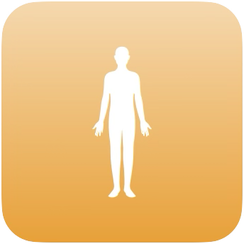
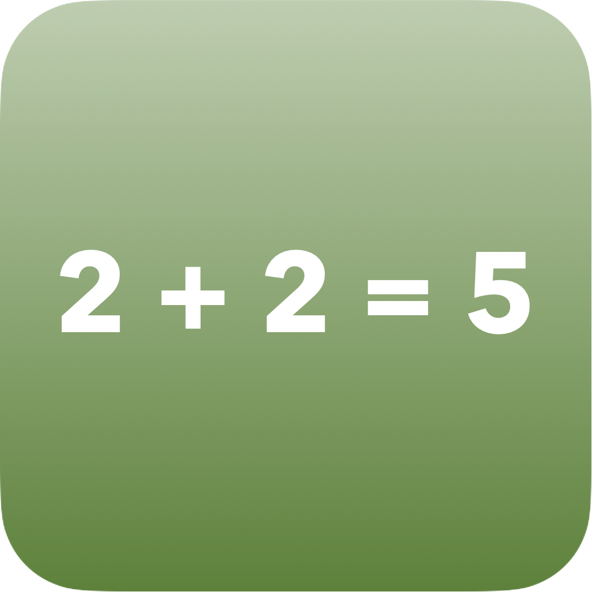
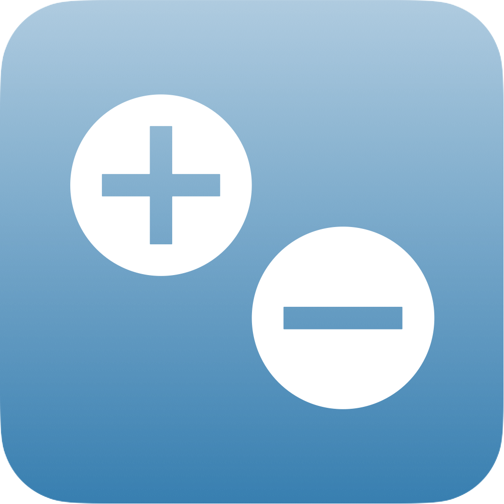
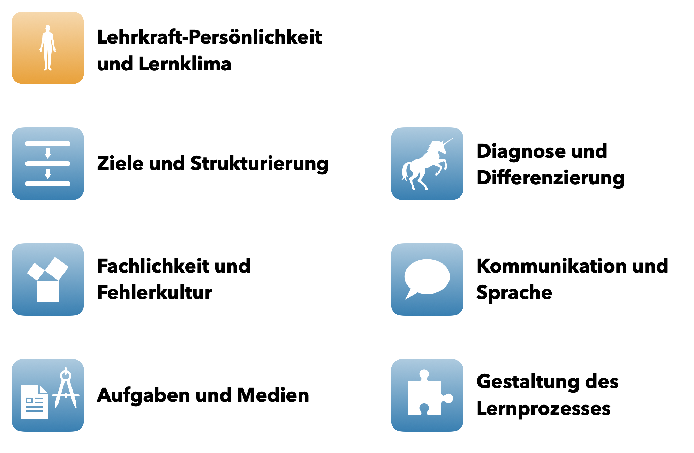

# Mathematikunterricht hospitieren

> **Material** (pdf-Dateien)  
>
> + **Dimensionen für Unterrichtsqualität**, angelehnt an die Materialien des Studienseminars Brandenburg  
>   + [Darstellung der Dimensionen](files/Dimensionen-von-Unterrichtsqualitaet-2022_Aspekte.pdf) (siehe Abschnitt \@ref(studienseminar-brandenburg))
>   + [Hospitationsbogen](files/Dimensionen-von-Unterrichtsqualitaet-2022_Hospitationsbogen.pdf) (siehe Abschnitt \@ref(beobachtung))
> + **Beobachtungskategorien** als Emfehlung für die fachdidaktischen Tagespraktika 
>   + [Darstellung der Beobachtungskategorien](files/Beobachtungskategorien.pdf) (siehe Abschnitt \@ref(empfehlung-fuer-ftp))
>   + [Hospitationsbogen](files/Beobachtungskategorien-Hospitationsbogen.pdf) (siehe Abschnitt \@ref(beobachtung))


## Warum hospitieren?

Sie werden im Rahmen Ihrer fachdidaktischen Tagespraktika sowohl den Unterricht erfahrener Lehrkräfte als auch den Ihrer Kommilitoninnen und Kommilitonen hospitieren. 
Die Hospitation verfolgt dabei mehrere Ziele:

* Sie **erhalten Anregungen**, wie Mathematikunterricht gestaltet werden kann -- sowohl aus pädagogischer als auch aus didaktischer und methodischer Perspektive.

* Sie **beurteilen strukturiert die Qualität** des beobachteten Unterrichts. 
Dies erfolgt über pädagogische, allgemeine didaktisch-methodische und spezifisch mathematikdidaktische Kriterien. 
Die Beobachtung erfolgt jedoch nicht zum Selbstzweck, sondern verfolgt weitere Ziele: 

  * Sie stellen **Theorie-Praxis-Bezüge** zwischen den Inhalten, die Sie in der Einführung in die Mathematikdidaktik (sowie der Stoffdidaktik und bildungswissenschaftlichen Lehrveranstaltungen) gehört haben und dem tatsächlichen Unterricht in der Schulrealität her. 
  Diese Bezüge greifen Sie dann später bei der **Planung Ihres eigenen Unterrichts** wieder auf.
  
  * Indem Sie lernen, die Qualität fremdem Unterrichts zu beurteilen, können Sie später auch besser die **Qualität Ihres selbst durchgeführten Unterrichts** beurteilen und Ihr eigenes Unterrichten reflektieren.
  
* Durch die Hospitation lernen Sie die Klasse und die Umgebung, in der Sie im Laufe der fachdidaktischen Tagespraktika unterrichten, kennen und nutzen Ihre Beobachtungen für das Erstellen einer **Bedingungsanalyse** (siehe Kapitel \@ref(bedingungsanalyse)).


## Qualitätskriterien {#qualitaetskriterien}

Dazu, was guten Mathematikunterricht auszeichnet, gibt es vielfältige Kriterien.
Je nach Zielstellung und Autorenkreis weichen diese teils deutlich voneinander ab und es kann nicht von *dem einen Modell* gesprochen werden, mit dem Sie arbeiten müssen.
Daher werden an dieser Stelle einige ausgewählte Kriterienkataloge vorgestellt (wobei diese Auswahl längst nicht vollständig ist -- siehe bspw. auch die Inhalte aus der Einführung in die Mathematikdidaktik) und anschließend erfolgt eine *für die Schulpraxis angepasste Empfehlung*, womit in den fachdidaktischen Tagespraktika gearbeitet werden kann. 
Auf die explizite Diskussion der Gemeinsamkeiten und Unterschiede der Kriterienkataloge bzw. mögliche Zusammenhänge zwischen den Kriterienkatalogen wird dabei verzichtet.


### FÜVVVAS

@Barzel2020 [26] beschreiben in ihrem Lehrbuch *Mathematik unterrichten: Planen, durchführen, reflektieren* sieben Qualitätskriteren guten Mathematikunterrichts. 
Zielgruppe des Buches sind **angehende Lehrerinnen und Lehrer für das Fach Mathematik**, weshalb eine Nutzung dieser Kriterien in den fachdidaktischen Tagespraktika möglich ist.
Die folgenden Stichpunkte sind der angegebenen Quelle als Zitat entnommen:

* **Fachlichkeit:** Spielen fachsprachlich präzise Begriffsbildungen und Formalisierungen eine angemessene Rolle? 
Haben fachliche Prozesse wie Problemlosen, Modellieren oder Argumentieren einen angemessenen Raum? 

* **Überfachlichkeit:** Haben personale und soziale Lernziele eine ausreichende Bedeutung? 
Erhalten Schülerinnen und Schüler beispielsweise genügend Verantwortung für das eigene Lernen? 
Lernen Sie zu kooperieren und zu kommunizieren? 

* **Verstehen:** Werden tragfähige Vorstellungen der mathematischen Konzepte aufgebaut? 
Nutzt der Unterricht dazu geeignete Darstellungen? 
Stehen Prozesse echten Verstehens im Vordergrund und wird nicht nur mit Rezepten gearbeitet? 

* **Vernetzung:** Werden die Begriffe mit den bereits früher erarbeiteten tragfähig vernetzt (vertikale Vernetzung)? 
Werden die Inhalte mit Vorerfahrungen der Schüler aus ihrer Lebenswelt oder mit passenden Anwendungssituationen verknüpft (horizontale Vernetzung)? 

* **Vielfalt:** Sind die Lernangebote hinsichtlich der unterschiedlichen Lernstände und Fähigkeiten hinreichend differenziert? 
Ist die Offenheit gegenüber verschiedenen Lösungen oder Lösungswegen und der methodische Umgang damit angemessen berücksichtigt? 

* **Authentizität:** Sind die mathematischen Inhalte und Prozesse authentisch? 
Ist das vermittelte Bild von Mathematik und der Art und Weise, wie Mathematik entsteht und angewendet wird, angemessen? 

* **Sinnstiftung:** Ist für die Schülerinnen und Schüler der Sinn der Tätigkeit ersichtlich? 
In Erarbeitungsstunden bedeutet das z. B.: Haben sie ein Ziel vor Augen, etwa das Lösen eines Problems? 
Erkennen sie, wozu sie mathematische Begriffe oder Verfahren erarbeiten? 
In Übungsstunden bedeutet das z. B.: Ist transparent, wozu geübt werden soll? 
Ist der Lerngegenstand zudem inhaltlich und in seiner Darstellung motivierend? 
Greift er mögliche Schülerinteressen auf?


### QuaMath

Im Rahmen des bundesweiten QuaMath-Projekts zur Unterrichts- und Fortbildungqualität im Fach Mathematik^[siehe https://www.quamath.de] wurden fünf Unterrichtsqualitätsmerkmale für das Fach Mathematik zusammengestellt.
Eine ausführliche Beschreibung ist beispielsweise bei @Holzapfel2024 zu finden. Zielgrupe dieses Projekts sind **erfahrene Lehrkräfte, Fortbildnerinnen und Fortbildner bzw. Multiplikatorinnen und Multiplikatoren für mathematikdidaktische Fortbildungen**.
Insofern bieten die Kriterien eine hohe Anknüpfung an mathematikdidaktische Theorien -- zielen aber nicht in erster Linie auf Anfängerinnen und Anfänger im Unterrichten.
Eine Nutzung dieser Kriterien in den fachdidaktitschen Tagespraktika ist daher ggf. in der praktischen Ausführung noch sehr herausfordernd.

Nach @Holzapfel2024 [3] erfüllt qualitätsvoller Mathematikunterricht folgende Kriterien, die in der genannten Quelle ausführlicher erläutert und mit entsprechenden mathematikdidaktischen Prinzipien in Verbindung gebracht werden:

* **Kognitive Aktivierung:** Aktive Lernprozesse anregen
* **Verstehensorientierung:** Konzepte, Strategien und Verfahren grundlegen
* **Durchgängigkeit:** Langfristiges Lernen ermöglichen
* **Lernenden-Orientierung und Adaptivität:** Lernstände aufgreifen
* **Kommunikationsförderung:** Über Mathematik sprechen


### Studienseminar Brandenburg

Das Studienseminar Brandenburg hat für **Referendarinnen und Referendare aller Unterrichtsfächer im Land Brandenburg** Kriterien und mögliche Indikatoren für die Beurteilung von Unterrichtsqualität zusammengestellt.
Die Kriterien sind in mehrere Dimensionen aufgeteilt und die Charakterisierung der Kriterien erfolgt über Indikatoren, bei denen teilweise zwischen Planung und Durchführung des Unterrichts unterschieden wird.

Die Kriterien sind unabhängig vom Unterrichtsfach formuliert und werden im Folgenden aufgezählt.
Der Kriterienkatalog inkl. der Indikatoren kann im Rahmen der fachdidaktischen Tagespraktika zur Verfügung gestellt werden.^[Da der Kriterienkatalog nicht öffentlich publiziert ist, kann er nicht hier in diesem Dokument zur Verfügung gestellt werden.]

* **Dimension der pädagogischen Beziehungsqualität**
  * Pädagogisch professionelle Haltung im Unterricht
  * Lernklima
  * Kommunikatives Verhalten
* **Fachliche Dimension**
  * Fachliche Qualität des Unterrichts
* **Didaktisch-methodische Dimension**
  * Didaktische Fundierung
  * Strukturierung des Unterrichts
  * Initiierung von Lernprozessen
  
Das Praxisteam der Mathematikdidaktik an der Universität hat unter den genannten Dimensionen und Kriterien eine **Anpassung der Indikatoren in Hinblick auf das Unterrichtsfach Mathematik** vorgenommen ([→ zur pdf-Datei](files/Dimensionen-von-Unterrichtsqualitaet-2022_Aspekte.pdf), dazu auch ein zugehöriger [Hospitationsbogen](files/Dimensionen-von-Unterrichtsqualitaet-2022_Hospitationsbogen.pdf)).
So soll eine bessere Anschlussfähigkeit der Schulpraktika im Studium an der Universität Potsdam an die Ausbildungsinhalte im Studienseminar in Brandenburg ermöglicht werden.
Insofern ist der (angepasste) Kriterienkatalog, wie die FÜVVVAS-Kriterien, ebenfalls gut für die fachdidaktischen Tagespraktika nutzbar.


### Schulqualität Brandenburg

Das Land Brandenburg hat im *Orientierungsrahmen Schulqualität* Kriterien für gute Schule herausgearbeitet [@MinisteriumfuerBildungJugendundSportdesLandesBrandenburg2016].
Insbesondere im Rahmen von Schulvistationen soll so die **Qualität von Schulen** beurteilt werden können, wobei verschiedene Qualitätsbereiche, die auch außerhalb des Unterrichts liegen können (z. B. die Schulkultur) Bestandteile sind.
Spezifisch für das Qualitätsmerkmal »Unterrichtsgestaltung« werden als Kriterien formuliert [@MinisteriumfuerBildungJugendundSportdesLandesBrandenburg2016 {S. 14 ff.}]:

* Fachliche Qualität des Unterrichts
* Deutliche Strukturierung und transparante Zielausrichtung des Unterrichts
* Didaktisch sinnvolle Einbindung von Medien und Methoden
* Differenzierung und Individualisierung
* Einsatz angemessener Lehrstrategien zur aktiven Teilnahme der Schülerinnen und Schüler am Unterricht
* Stimulieren der Schülerinnen und Schüler zum selbstständigen Lernen, zur Zusammenarbeit und gegenseitigen Unterstützung
* Möglichkeiten für Schülerinnen und Schüler, eigene Lösungen zu entwickeln, darzulegen und zu reflektieren
* Lernförderliches Klima im Unterricht
* Klassenmanagement

Zu den Kriterien werden schulische Maßnahmen sowie Instrumente und Methoden angebeben, mit denen die Kriterien jeweils erreicht werden können.
Diese Erläuterungen sind durchaus als Anregungen für die Gestaltung des Mathematikunterrichts in den fachdidaktischen Tagespraktika geeignet -- auch wenn der Kriterienkatalog an sich fachunabhängig und an bereits praktizierenden Lehrkräften orientiert ist. 


### Empfehlung für FTP {#empfehlung-fuer-ftp}

Die für die fachdidaktischen Tagespraktika empfohlenen Kategorien zur *strukturierten* Unterrichtsbeobachtung ([→ zur pdf-Datei](files/Beobachtungskategorien.pdf)) lehnen sich an die zuvor genannten Kriterien an und verfolgen insbesondere das Ziel, Bezüge zu den Vorlesungsinhalten der Einführung in die Mathematikdidaktik und zu den [Zielkompetenzen der fachdidaktischen Tagespraktika](#ziele-der-ftp) herzustellen -- v. a. unter dem Gesichtspunkt, dass es sich um die ersten Unterrichtsversuche der Studierenden handelt.  
Während die erste Kategorie eher **pädagogischer** Natur ist, folgen sechs Kateogrien eher **mathematikdidaktischer** Natur.
Diese Trennung ist jedoch nicht immer scharf und eine Zuordnung möglicher Inhalte nicht immer eindeutig -- so kann etwa durch eine geeignete Aufgabenauswahl differenzierender Unterricht ermöglicht werden oder die Gestaltung des Lernprozesses bewirkt kommunikationsförderliche Unterrichtssituationen usw.

<!--* **Lehrkraft-Persönlichkeit & Lernklima:** umfasst Körpersprache, Stimme und Raumverhalten der Lehrkraft, das von ihr verkörperte Rollenbild und ihre Empathie gegenüber den Schülerinnen und Schülern

* **Classroom-Management:** umfasst die Orchestrierung des Unterrichts (z. B. Raum-, Zeit-, Lichtmanagement) sowie den Umgang mit Störungen bzw. die Störungsprävention

* **Strukturierung und Zielorientierung:** umfasst die angemessene Strukturierung der Unterrichtsstunde in Phasen und Phasenübergänge sowie die Transparenz der Struktur gegenüber den Schülerinnen und Schülern, die Formulierung von Kompetenzzielen für die Unterrichtsstunde sowie deren Transparenz, Verfolgung und Überprüfung während des Unterrichtens

  Ausführliche Informationen zu dieser Kategorie bieten die Kapitel \@ref(kompetenzziele) und \@ref(unterrichtsphasen).

* **Differenzierung:** umfasst verschiedene Zugänge zum Lerngegenstand, Vielfalt in Lösungswege sowie eine individuelle Forderung und Förderung der Schülerinnen und Schüler

* **Methoden:** umfasst die Auswahl und den Einsatz geeigneter Unterrichtsmethoden unter dem besonderen Aspekt des Erwerbs mathematischer Kompetenzen

* **Fehlerkultur:** umfasst einen wertschätzenden und fachlich produktiven Umgang mit Fehlern der Schülerinnen und Schüler sowie eigenen Fehlern

* **Kommunikationsförderung:** umfasst die Maßnahmen zur Kommunikation zwischen den Schülerinnen und Schülern und mit der Lehrkraft, inkl. der Gestaltung sprachsensiblen Mathematikunterrichts

* **Fachlichkeit:** umfasst die fachliche Korrektheit und Flexibilität, die Durchgängigkeit der ausgewählten Inhalte und den angemessenen Umgang mit Fachsprache

* **Verstehensorientierung:** umfasst eine auf das Verständnis orientierte Gestaltung des Mathematikunterrichts (insb. über Grundvorstellungen und Kernideen)

* **Aufgabengestaltung:** umfasst die Auswahl, Formulierung und den Einsatz von Aufgaben (insb. zur kognitiven Aktivierung und zum produktiven Üben)

* **Material und Visualisierungen:** umfasst Auswahl, Gestaltung und Einsatz geeigneter Darstellungen (inkl. verschiedener Repräsentationsebenen), Arbeitsmittel, Medien und Materialien

* **Spezifische lerngegenstandsabhängige mathematikdidaktische Theorien:** umfasst spezifische Maßnahmen zur Bildung von Begriffen (z. B. Wege zum Begriff, Auswahl von Beispielen und Gegenbeispielen, …), Sachverhalten (inkl. Argumentationsanlässe) und Verfahren, die Gestaltung vollständiger oder teilweiser Modellierungssituationen sowie die Ausbildung und Verwendung von Heurismen zum Lösen problemhaltiger Aufgaben-->

*  **Lehrkraft-Persönlichkeit & Lernklima**
  - Körpersprache, Stimme und Raumverhalten
  - verkörpertes Rollenbild
  - Empathie gegenüber den Schülerïnnen

* **Ziele und Strukturierung**
  - Auswahl (insb. Eignung für langfristigen Kompetenzerwerb) und Formulierung von Zielen
  - Orientierung des Lernpfades an stoffdidaktischer Analyse (u. a. Durchgängigkeit der ausgewählten Inhalte, geeignete Kernideen und Kontexte)
  - angemessene Strukturierung der Unterrichtsstunde in Phasen und Phasenübergänge
  - Transparenz der Struktur und Ziele gegenüber den Schülerïnnen

    Ausführliche Informationen zu dieser Kategorie bieten die Kapitel \@ref(kompetenzziele) und \@ref(unterrichtsphasen).


* **Fachlichkeit und Fehlerkultur** 
  - fachliche Korrektheit und Flexibilität
  - wertschätzender und fachlich produktiver Umgang mit Fehlern (eigene und der Schülerïnnen)
  - Verstehensorientierung / Orientierung an Grundvorstellungen
  - operatives Durcharbeiten


* **Aufgaben und Medien**
  - durchgängige Darstellungen, Arbeitsmittel und Visualisierungen
  - verschiedene Repräsentationsebenen, Darstellungswechsel und -vernetzung
  - funktionsgerechte Aufgaben (kognitiv aktivieren, erkunden, systematisieren, (produktiv) üben)
  - Formulierung mithilfe von Operatoren


* **Diagnose und Differenzierung**
  - Identifizieren von Lernvoraussetzungen (inkl. intuitiver Vorstellungen) und Aufarbeiten dieser
  - Planung und Umsetzung verschiedener Differenzierungsmaßnahmen (unterschiedliche Zugänge, Anpassung des Schwierigkeitsgrads, natürliche Differenzierung, …)
  - Vielfalt in Lösungswegen


* **Kommunikation und Sprache** 
  - Maßnahmen zur Kommunikation zwischen den Schülerïnnen und mit der Lehrkraft
  - sprachsensibler Mathematikunterricht  und fachbezogene Sprachbildung (u. a. Aufbau der Fachsprache)


* **Gestaltung des Lernprozesses** 
  - geeignete Unterrichtsmethoden
  - Bildung von Begriffen, Zusammenhängen/Sachverhalten und Verfahren
  - Gestaltung von Modellierungs- und Problemlöseprozessen
  - Organisation geeigneter Hilfen
  - Orchestrierung des Unterrichts (u. a. Raum-, Zeit-, Lichtmanagement) 
  - Umgang mit Störungen und Störungsprävention


Die in den Aufzählungungen formulierten Kategorienbeschreibungen reichen in keinem Falle aus, die Kategorien inhaltlich durchdrungen zu haben.
Hierzu ist eine Beschäftigung mit den erwähnten Inhalten notwendig.

## Hospitationsmöglichkeiten

Unterricht kann auf vielfältige Weise hospitiert und die Beobachtungen auch vielfältig ausgewertet werden.


### Beobachtung

@Barzel2020 [{155 f.}] beschreiben zwei prinzipielle Wege zur Beobachtung von Unterricht.

* **Unterrichtsprotokoll:** Hierbei werden die Beobachtungen des Unterrichts chronologisch notiert, es erfolgt damit eine Orientierung an der **Strukturierung des Unterrichts**.

* **Kriteriengeleitete Beobachtung:** Hierbei werden im Vorfeld Kriterien festgelegt und der Unterricht an diesen orientiert beobachtet.
Häufig werden dabei **Hospitationsbögen** genutzt.
Sowohl für die an die Materialien des Studienseminars Brandenburg angelehnten Dimensionen für Unterrichtsqualität (vgl. Abschnitt \@ref(studienseminar-brandenburg)) als auch für die für die fachdidaktischen Tagespraktika empfohlenen Beobachtungskategorien (vgl. Abschnitt \@ref(empfehlung-fuer-ftp)) werden hier Hospitationsbögen zur Verfügung gestellt.
  * [Hospitationsbogen nach den Dimensionen für Unterrichtsqualität ](files/Dimensionen-von-Unterrichtsqualitaet-2022_Hospitationsbogen.pdf) 
  * [Hospitationsbogen für die empfohlenen Beobachtungskategorien](files/Beobachtungskategorien-Hospitationsbogen.pdf)
  
Um eine Hospitation zu ermöglichen, die »einerseits eine inhaltliche Fokussierung auf zentrale Bereiche ermöglicht und andererseits die fachdidaktische Perspektive berücksichtigt«, schlagen @Barzel2020 [{156 ff.}] vor, im Vorfeld **Prüffragen** zu formulieren, anhand derer die Erfüllung bestimmter (mathematikdidaktischer) Kriterien beurteilt werden kann. Dies setzt i. d. R. voraus, dass die grobe Planung der Unterrichtsstunde vor der Hospitation bekannt ist.

> Wird etwa eine Unterrichtsstunde zu Darstellungen von Daten in Diagrammen gehalten, könnte bspw. hinsichtlich der **Aufgabengestaltung** gefragt werden: *Handelt es sich um authentische Daten, die in Diagrammen dargestellt werden sollen?*. Bezüglich der **Differenzierung** könnte man fragen: *Erhalten die Schülerinnen und Schüler genügend Freiheiten, eine geeignete Diagrammart selbstständig auszuwählen?*

Weiterhin empfehlen @Barzel2020 [{S. 156}, Hervorhebungen H. E.], in jedem Falle »während des Unterrichtsverlaufs zu **notieren, welche Lernziele erkennbar und welche Kompetenzen vermeintlich angestrebt** werden.«
Über einen Abgleich in der Nachbesprechung mit der unterrichtenden Lehrkraft kann so die Zieltransparenz und -erfüllung beurteilt werden.

Sie sollten im Laufe der Fachdidaktischen Tagespraktika einen für sich gangbaren Weg der Unterrichtsbeobachtung finden, um Ihre spätere eigene Unterrichtsplanung und -durchführung zu professionalisieren.


### Nachbesprechung

@Koehler2015 [{S. 61 ff.}] beschreiben verschiedene Möglichkeiten der Nachbesprechung von Unterricht. 
Für die fachdidaktischen Tagespraktika in Gruppen von ca. 5 Personen sollen daraus folgende Besprechungsmöglichkeiten extrahiert werden:

* **Freie Kartenabfrage:** Hierbei erhalten die beobachtenden Studierenden Karten verschiedener Farben, auf denen sie positive Rückmeldungen sowie Rückfragen und/oder kritsiche Anmerkungen notieren.
Anschließend werden die Karten gemeinsam ausgewertet.

* **Gebundende Kartenabfrage:** Diese Methode ist ähnlich wie die gebundene Kartenabfrage, nur dass die Karten den zuvor festgelegten Beobachtungskategorien (siehe z. B. Abschnitt \@ref(empfehlung-fuer-ftp)) zugeordnet sind.

* **Suppenteller:** Bei dieser Variante geben die beobachtenden Studierenden offene Rückmeldungen zur Unterrichtsstunde.

Je nachdem, welches Ziel Sie verfolgen und welche der Auswertungsmethoden Ihnen näher liegt, kann das Vorgehen im Praktikum angepasst werden.
Auch Mischformen oder Abweichungen sind möglich, beispielsweise können **auf Karten notierte Beobachtungen nachträglich den Beobachtungskriterien zugeordnet werden** (Mischung aus offener und gebundener Kartenabfrage) oder die Studierenden **teilen im Vorfeld Beobachtungsschwerpunkte untereinander auf**.
Je ungebundener die Auswertungsmethode hinsichtlich der Beobachtungskriterien ist, desto mehr empfiehlt sich jedoch eine **Orientierung an der Struktur der Unterrichtsstunde**, um ein gänzlich unsystematisches Vorgehen zu vermeiden.
Auch muss die Einschätzung der **Kompetenzzielerfüllung** Bestandtteil einer jeden Unterrichtsauswertung sein.

Unabhängig davon, welche konkrete Auswertungsvariante gewählt wird, wird bei der Nachbesprechung folgender Ablauf verfolgt:

1. Der unterrichtende Studierende reflektiert kurz selbst die gehaltene Stunde:
    * *Was lief gut, was lief nicht so gut? Warum vermutlich?*
    * *Was würden Sie in Planung und Durchführung anders machen, wenn Sie die Stunde nochmal halten müssten?*  

2. Anschließend erfolgt die gemeinsame Nachbesprechung nach einer der oben genannten oder daran angelehnten Auswertungsmethode.

3. Im Nachgang werden durch den Dozierenden noch einmal Hinweise zu Stärken und Entwicklungsschwerpunkten zusammengefasst.


## Zusammenfassung {#zusammenfassung-hospitieren}

Sie hospitieren Mathematikunterricht, um **Anregungen** für Ihr eigenes Unterrichten zu erhalten und um zu lernen, wie man die **Qualität von Mathematikunterrich** strukturiert beurteilen kann.

Aus den verschiedensten Modellen zu Qualitätskriterien von Unterricht werden für die fachdidaktischen Tagespraktika **Beobachtungskategorien** empfohlen, die sich aus pädagogischen, allgemeinen didaktisch-matheodischen und stärker auf mathematikdidaktische Theorien basierenden Kategorien zusammensetzen. 

```{r Beobachtungskategorien-kompakt, echo=FALSE, fig.cap="Empfohlende Beobachtungskategorien für die fachdidaktischen Tagespraktika", fig.align='center', out.width='75%'}

```

Die Hospitation kann entweder **chronologisch anhand der Stundenstruktur** oder direkt **kriteriengeleitet mithilfe eines Hospitationsbogens**  ([→ zur pdf-Datei](files/Beobachtungskategorien-Hospitationsbogen.pdf)) erfolgen.

In der Auswertung Ihrer eigenen Unterrichtsstunden geben Sie zunächst eine Selbsteinschätzung, bevor dann in der Gruppe die Unterrichtsstunde nachbesprochen wird und Sie eine Rückmeldung zu eigenen Stärken und Entwicklungsschwerpunkten erhalten.
