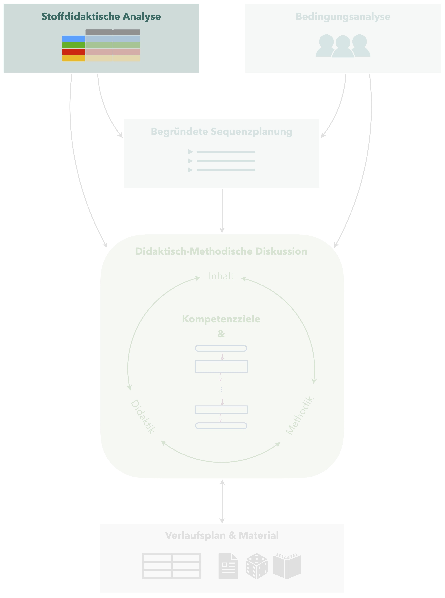
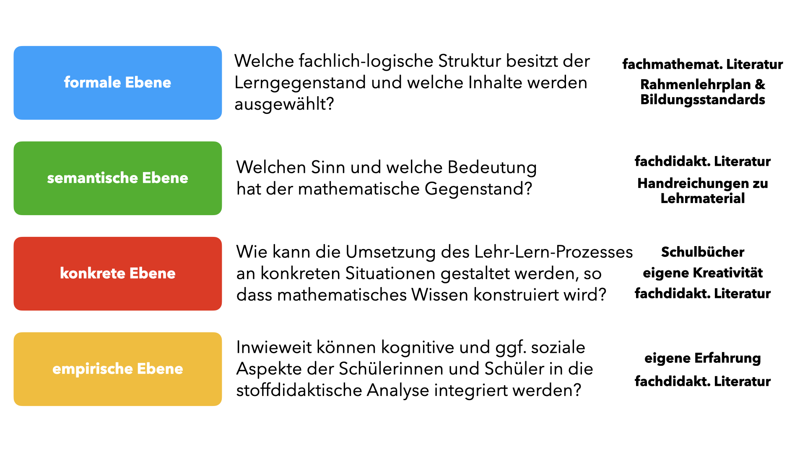
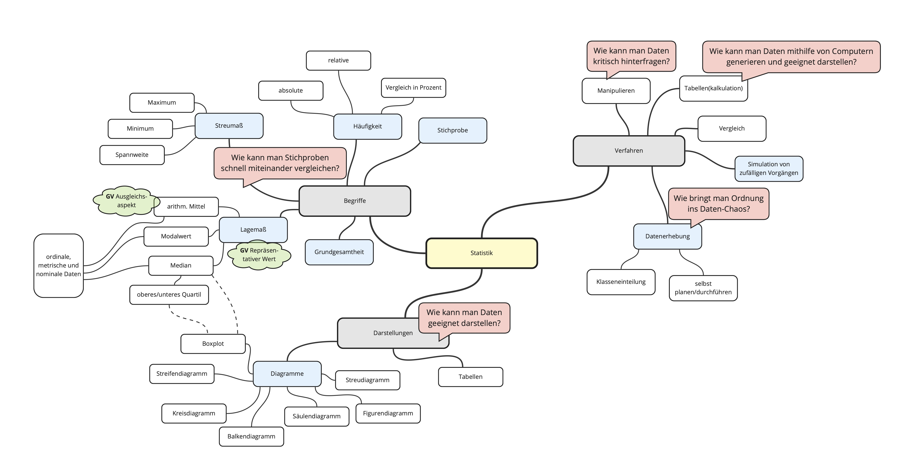

# (PART\*) Vorbereitungen zur Sequenz {.unnumbered}  

# Stoffdidaktische Analyse

 Eine stoffdidaktische Analyse ist notwendig, damit Sie den zu unterrichtenden **Lerngegenstand aus fachlicher und fachdidaktischer Sicht durchdringen** können und einen prinzipiellen **Lernpfad** aufstellen können, nach dem der Lerngegenstand behandelt werden kann. 

## Spezifisches Vorgehen

Wie eine stoffdidaktische Analyse erstellt wird, ist Bestandteil der Veranstaltung zur *Stoffdidaktik Mathematik*.
Abbildung \@ref(fig:Vier-Ebenen) fasst den prinzipiellen Aufbau nach dem Vier-Ebenen-Ansatz nach @Hussmann2016a samt jeweils geeigneter Quellen noch einmal zusammen, wobei Sie Details im Skript zur Stoffdidaktikveranstaltung [@Etzold2024e] nacharbeiten können. 

```{r Vier-Ebenen, echo=FALSE, fig.cap="Stoffdidaktische Analyse nach dem Vier-Ebenen-Ansatz", fig.align='center', out.width='75%'}

```

Als bedeutsame weitere Quellen kommen in den fachdidaktischen Tagespraktika noch das **verwendete Schulbuch** sowie das **schulinterne Curriculum** hinzu.

In den fachdidaktischen Tagespraktika wird die stoffdidaktische Analyse **gemeinsam erarbeitet**. 
Dabei bietet sich eine verkürzte Übersicht in Form einer **Mindmap** an, die die wesentlichen Begriffe/Sachverhalte/Verfahren, Grundvorstellungen und Kernideen bzw. mögliche Kontexte zum Lerngegenstand darstellt [vgl. auch @Sturm2024 28].


<div class="beispiel">

## Beispiel {#beispiel-stoffdidaktische-analyse}

*erarbeitet von Paul Lindstaedt, Anwar Nacoul, Stefanie Schäfer und Celina Schneevoigt, angepasst durch Heiko Etzold*

Abbildung \@ref(fig:Stoffdidaktische-Analyse) zeigt eine kompakte Übersicht, wie sie als Ergebnis einer stoffidaktischen Analyse zum Lerngegenstand *Daten* in Klassenstufe 7 aussehen könnte ([→ zur pdf-Datei](files/Stoffdidaktische-Analyse.pdf)). 
Das Beispiel wird sich durch die folgenden Kapitel ziehen. 


```{r Stoffdidaktische-Analyse, echo=FALSE, fig.cap="Mindmap zum Lerngegenstand *Daten* in Klassenstufe 7", fig.align='center', out.width='95%'}

```

</div>


