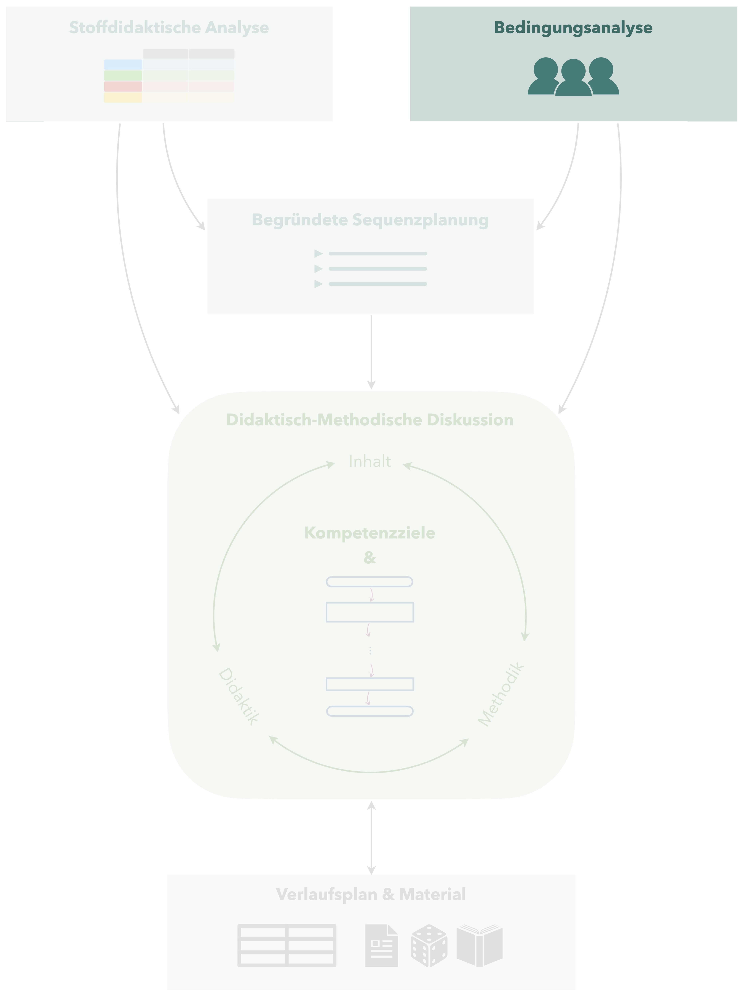

# Bedingungsanalyse 

 
Um Ihren Unterricht addressatengerecht planen und gestalten zu können, müssen Sie zunächst Klarheit darüber haben, unter welchen Bedingungen Sie unterrichten -- Sie erstellen eine Bedingungsanalyse. Dies betrifft sowohl die **Lehrvoraussetzungen**, also das gesamte äußere unterrichtliche Umfeld, als auch die **Lernvoraussetzungen**, also die individuellen Kompetenzen der Schülerinnen und Schüler, auf die Sie Ihren Unterricht aufbauen.

Mögliche **Quellen** zum Identifizieren derartiger Bedingungen sind in erster Linie die Unterrichtsbeobachtung, Gespräche mit der Lehrkraft, aber auch ein Blick in die Hefter der Schülerinnen und Schüler, das Schulbuch, Gespräche mit den Lernenden oder auch kleine Diagnosetest zu Beginn der Unterrichtssequenz usw. 

## Lehrvoraussetzungen

Zu den Lehrvoraussetzungen gehören alle Bedingungen, die Ihr Lehrumfeld beeinflussen und nicht spezifisch abhängig von den individuellen Schülerinnen und Schülern sind.
Dazu gehören u. a.:

* **Klassenstufe und Schulform** (ggf. Leistungs- und Begabungsklasse?)
* **Besonderheiten der Schule** (Aufnahmetests, Freiarbeit, …)
* **Lage und Dauer der Unterrichtsstunde** (direkt nach der Mittagspause, nach einer Sportstunde, zu Beginn der Woche, aber auch A- und B-Wochen, …)
* **Ausstattung des Unterrichtsraums** (verfübare Medien, Größe des Raumes, Lichtverhältnisse, …)
* **Gewohnheiten** in der Schule bzw. Klasse (Wie erfolgt die Begrüßung? Gibt es einen Austeildienst für Arbeitsblätter? Gibt es ein Stundenklingeln? Wann müssen die Schülerinnen und Schüler im Unterrichtsraum sein? …)
* …

Die dargestellte Liste ist längst nicht erschöpfend und soll daher eher als Orientierung dienen, die Lehrvoraussetzungen zusammentragen zu können.

## Lernvoraussetzungen

### Kompetenzbereiche 

Um die Lernvoraussetzungen vollumfänglich identifizieren zu können, bietet es sich an, verschiedene Kompetenzbereiche zu betrachten. In der Regel wird zwischen **Sach-, Personal-, Sozial- und Methodenkompetenz** unterschieden.
Eine Zuordnung muss nicht immer zwingend eindeutig erfolgen -- vielmehr hat das Explizitmachen dieser Bereiche das Ziel, keine der Bedingungen zu vergessen.

Zur Erläuterung der vier Kompetenzbereichen wird im Rahmen des Praktikum ein Informationsvideo zur Verfügung gestellt.

### Leitfragen

*erarbeitet von Brit Reinhardt*<!--, Studienseminar Bernau*-->

Die folgenden Leitfragen können Ihnen Unterstützung beim Aufstellen der Lernvoraussetzungen bieten.

**Lernvoraussetzungen allgemein**

* Gibt es Besonderheiten hinsichtlich der Klassenzusammensetzung?
* Welche Schülerinnen und Schüler haben einen besonderen Förderbedarf? (in alle Richtungen denken!)
* Auf welchen Niveaustufen der Kompetenzentwicklung laut RLP Teil C befinden sich die Schülerinnen und Schüler?
* Sind die Schülerinnen und Schüler eher lehrerzentrierte oder offene Unterrichtskonzepte gewohnt?
* Wie ist die Einstellung zum Fach?
* Wie ist das Lernklima generell einzuschätzen?
* Spielen entwicklungspsychologische Besonderheiten eine Rolle?

**Lernvoraussetzungen für die konkrete Stunde**

* Welches fachliche Vorwissen bringen die Schülerinnen und Schüler zur geplanten Unterrichtsstunde mit und welche Defizite zeigten sich diesbezüglich?
* Welche Fachbegriffe sind für die Thematik der Stunde nötig?
* Welche fachlichen Voraussetzungen müssen die Schülerinnen und Schüler haben, um am Thema der Stunde arbeiten zu können?
* Gibt es Schülerinnen oder Schüler, die fachbezogen besondere Fähigkeiten oder Einstellungen haben?
* Welches methodische Vorwissen bringen die Schülerinnen und Schüler bezüglich der geplanten Unterrichtsstunde mit? (fachspezifische Lern- und Arbeitstechniken, Lernstrategien, …)
* Welche sozialen Voraussetzungen bringen die Schülerinnen und Schüler mit, die in der geplanten Unterrichtsstunde eine Rolle spielen?
* Welche Anforderungen an die Personalkompetenz stellt die geplante Unterrichtsstunde an die Schülerinnen und Schüler und wie sind sie diesbezüglich einzuschätzen?
* Welches Vorwissen bringen die Schülerinnen und Schüler bezüglich der geplanten Unterrichtsmethoden für die Unterrichtsstunde mit?

## Beispiel {#beispiel-bedingungsanalyse}

*erarbeitet von Jonas Braun, angepasst durch Heiko Etzold*

Das folgende Beispiel stellt die Bedingungsanalyse für eine 7. Klasse dar, in der eine Sequenz zum Thema *Daten* unterrichtet wird. 

### Lehrvoraussetzungen {-}

Die zu planende Mathematikunterrichtsstunde findet in den letzten Wochen des Schuljahres in einer siebten Klasse am Potsdamer *XYZ*-Gymnasium statt. 
Der Klassenverband besteht aus insgesamt 29 Lernenden – darunter 14 Mädchen und 15 Jungen – wobei es derzeit aus gesundheitlichen Gründen häufig zu Abweichungen kommt.
Die Schülerinnen und Schüler sind erst seit diesem Schuljahr an der Schule, kennen sich also ein Schuljahr lang.

> Diese Abweichungen müsen sich insbesondere in einer methodischen Flexibilität der Unterrichtsplanung widerspiegeln. 

Der Unterricht in der ersten Stunde des Schultages statt, die Dauer der Unterrichtsstunde beträgt 45 Minuten. 
Da sich das Schuldgebäude in unmittelbarer Nähe einer viel befahrenen Straße befindet, ist beim Lüften jetzt im Sommer mit starkem und störendem Lärm zu rechnen. 
Zur Verfügung stehen, bezüglich der technischen Ausstattung, unter anderem ein Whiteboard und ein Beamer. 
Die gleichzeitige Nutzung von Beamer und Whiteboard ist möglich, wenn das Whiteboard nicht zu hoch geschoben wird, da sich die Projektionsfläche des Beamers direkt oberhalb des Whiteboards befindet. 
Darüber nutzen einige Schülerinnen und Schüler eigene Tablets für ihre Aufzeichnungen, andere arbeiten mit ihrem Hefter. 
Als Schulbuch wird »Fundamente Mathematik« vom Cornelsen-Verlag genutzt.

### Lernvoraussetzungen {-}

#### Sachkompetenz {-}
Insgesamt stellt das Klassengefüge eine eher leistungsheterogene Konstellation dar – während einige Schülerinnen und Schüler die Arbeitsaufträge zügig erledigen sowie das Unterrichtsgeschehen mit ihren produktiven Beiträgen bereichern können (beispielweise *XYZ*), fällt anderen selbst das Anwenden vermeintlicher Grundkenntnisse sichtbar schwer (v. a. *XYZ*). Dies zeigte sich beim Hospitieren unter anderem an Unterrichtsgesprächen, der unterschiedlich ausfallenden mündlichen Mitarbeit sowie den Ergebnissen der täglichen Übung. 
Die Schülerinnen und Schüler lernen erst seit fast einem Jahr gemeinsam in der Sekundarstufe I und haben, laut schulinternem Lehrplan, den Themenbereich »Statistik« bisher noch nicht im Unterricht behandelt. Unsere Unterrichtssequenz soll demnach in die Leitidee »Daten und Zufall« einführen und kann folgerichtig kein spezifisches Vorwissen der Lernenden – zu Datenerhebungen, Diagrammarten, Kennwerten oder ähnlichem – voraussetzen. 
Hinsichtlich der inhaltsbezogenen Kompetenzen ist zudem zu erwähnen, dass mathematische Grundfertigkeiten, wie das Rechnen oder »Transformieren« im Zusammenhang mit (Dezimal-) Brüchen und Prozentzahlen, nicht nur praktisch für den Umgang mit Daten sind, sondern auch regelmäßig im Unterricht – insbesondere im Rahmen der täglichen Übung – trainiert werden und scheinbar weitgehend gefestigt sind. Bei dem Thema »Säulendiagramme«, das im Zentrum der zu planenden Stunde steht, können die Schülerinnen und Schüler gegebenenfalls auf Vorwissen aus Alltagserfahrungen zurückgreifen – schließlich sind derartige Darstellungsformen nicht selten etwa beim Fernsehen oder im Kontext anderer Unterrichtsfächer zu sehen. Die weitere Erhebung der individuellen (inhaltsbezogenen) Kompetenzstände durch Check-In-Tests war aus organisatorischen Gründen nicht umsetzbar. 

#### Sozialkompetenz {-}

Die Schülerinnen und Schüler gehen inner- und außerhalb des Unterrichts respektvoll miteinander um, was sich im Besonderen an der positiven Fehlerkultur bemerkbar macht. 
Auf die Beiträge eines Gesprächspartners – ob nun richtig oder falsch – wird im Allgemeinen wertschätzend reagiert, das Auslachen wegen Fehler oder aber das Ausgrenzen einer einzelnen Person konnte im Zuge des Hospitierens nicht beobachtet werden – weshalb erarbeitende Lehrer-Schüler-Gespräche sowie Partnerarbeiten zumeist produktiv verlaufen. 
Alles in allem harmonieren die Lernenden miteinander und sorgen so für ein positives Klassenklima, wenngleich Unterrichtsstörungen dadurch scheinbar begünstigt werden. 
 
#### Methodenkompetenz {-}

Die Erarbeitung neuer Inhalte erfolgte während der hospitierten Unterrichtsstunde in aller Regel im Lehrer-Schüler-Gespräch, vor allem in Verbindung mit anschließender eigenständiger Lehrbucharbeit. 
Alternative Sozialformen, wie Partnerarbeit, oder aber Formen des entdeckenden Lernens konnten hingegen nur vereinzelt beobachtet werden. 
Auf eine ordnungsgemäße Hefterführung wird seitens der Lehrkraft großen Wert gelegt: Während das eigenständige Bearbeiten der Aufgaben im Übungsabschnitt erfolgt, werden die – zumeist am Whiteboard – gesicherten Ergebnisse, Definitionen oder Sätze in den »Merkteil« übernommen. 
Die Hefterführung erscheint jedoch bei einigen Lernenden recht chaotisch (v. a. bei *XYZ*). 
Die bereits erwähnte »tägliche Übung« kann/soll, in Rücksprache mit der Lehrkraft, im Rahmen der Unterrichtsreihe zum Thema »Daten« ausgesetzt werden. 

#### Personalkompetenz {-}

Die motivationalen Lernvoraussetzungen der Lernenden fallen auf individueller Ebene sehr unterschiedlich aus. 
Insbesondere die ungleiche mündliche Beteiligung sowie das, bei eigenständigem Arbeiten, mangelnde Durchhaltevermögen einiger Schülerinnen und Schüler (zum Beispiel *XYZ*) machen dies deutlich. 

> Der Unterrichtsentwurf sollte daher ein methodisches Vorgehen berücksichtigen, welches auch die sonst zurückhaltenden beziehungsweise demotivierten Lernenden aktiv in den Unterrichtsprozess integriert.

Da bezüglich des sorgfältigen Arbeitens – etwa beim Abschreiben der Merksätze oder Bearbeiten der Aufgaben – teils noch Entwicklungspotenziale bestehen (insb. bei *XYZ*), sollte das Arbeitsverhalten der Lernenden diesbezüglich, mit Blick auf das Raumverhalten, aufmerksam beobachtet werden. 

