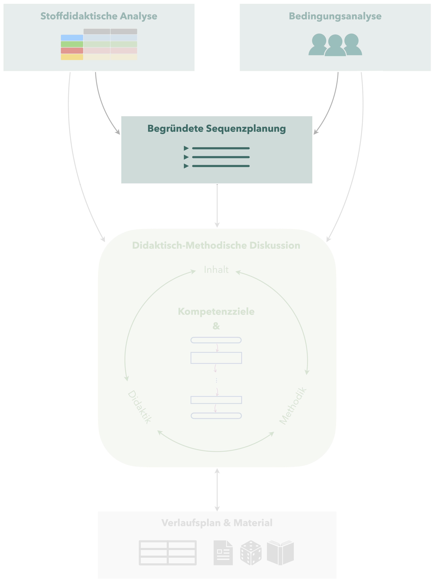

# Begründete Sequenzplanung

 Aus der Bedingungsanalyse und der stoffdidaktischen Analyse heraus kann nun eine finale Sequenzplanung erstellt werden. 

## Aufbau der Sequenzplanung

In der Sequenzplanung sollten für jede Unterrichtsstunde folgende Dinge angegeben werden:

* **Datum/Zeit**
* **Überschrift:** Es bietet sich an, dass jede Stunde eine Art »Überschrift« erhält. Dies kann als *Thema* der Stunde zusammengefasst werden oder Sie formulieren eine *Kernfrage*, die für die jeweilige Stunde charakteristisch ist.
* **Wesentliche Inhalte:** Hierzu sollten Sie die in der jeweiligen Unterrichtstunde wesentlichen Inhalte aufzählen, was als Auszug aus dem *Lernpfad* angesehen werden kann. Über die Sequenz hinweg sollten sich bspw. alle Bestandteile der Mindmap (vgl. Abschnitt \@ref(spezifisches-vorgehen)) hier wiederfinden.
* Wird der Unterricht an einem *didaktischen Schwerpunkt* orientiert (vgl. Anhang \@ref(didaktischer-schwerpunkt)), sollte auch dieser in der Sequenzplanung für jede Unterrichtsstunde angegeben werden. 

Während der Lernpfad der stoffdidaktischen Analyse eine grobe Orientierung für die Sequenz gibt, spielen **weitere Randbedingungen** (längere unterrichtsfreie Zeiten, z. B. durch Ferien, Notwendigkeit von Übungsstunden, Schreiben von Leistungskontrollen, …) eine wesentliche Rolle beim Aufbau der Sequenz.

Da in den fachdidaktischen Tagespraktika keine ausführliche stoffdidaktische Analyse verlangt wird, ist es notwendig, zumindest die Sequenz zu **begründen**. Dabei beziehen Sie sich auf die (ggf. gedanklich) durchgeführte stoffdidaktische Analyse, damit der Ablauf der Sequenz nachvollzogen werden kann. 
Im Rahmen Ihrer ausführlichen Unterrichtsplanung sollten Sie in der Darstellung der Sequenzplanung außerdem Ihre **konkrete Unterrichtsstunde hervorheben**, damit diese besser eingeordnet werden kann.

## Beispiel {#beispiel-sequenzplanung}

*erarbeitet von Jonas Braun*

In der hier beispielhaft dargestellten Sequenzplanung für das Thema *Daten* ist zur Pseudonymisierung statt dem Datum die Nummer der Unterrichtsstunde angegeben.

<table>
<tr>
<th>Nr.</th>
<th>Thema/Kernfrage</th>
<th>wesentliche Inhalte</th>
<th>did. Schwerpunkt</th>
</tr>

<tr>
<td rowspan="2">1/2</td>
<td rowspan="2">Erheben von Daten, Säulendiagramme; *Wie bringe ich Ordnung ins Daten-Chaos?*</td>
<td>Einführung in Thema »Daten«, Durchführung einer Umfrage, Erstellen von Säulendiagramm</td>
<td>Lebensweltbezug</td>
</tr>

<tr>
<td>Merkmale guter Säulendiagramme, Übung</td> 
<td>Instruktion, Problemorientierung</td>
</tr>

<tr>
<td rowspan="2">3/4</td>
<td rowspan="2">Absolute und relative Häufigkeit</td>
<td>Einführung der Begriffe, Bedeutung der relativen H.</td>
<td>Entdeckendes Lernen</td>
</tr>

<tr>
<td>Übungen zu absoluter und relativer Häufigkeit</td>
<td>Aufgabenorientierung</td>
</tr>

<tr>
<td>5/6</td>
<td>Diagrammarten; *Wie kann ich Statistiken übersichtlich darstellen?*</td>
<td>Einführung diverser Diagrammarten (außer Boxplot)</td>
<td>Entdeckendes Lernen, Exemplarität</td>
</tr>

<tr> 
<td>7/8</td>
<td>Kennwerte; *Wie kann ich Statistiken gut miteinander vergleichen?*</td>
<td>Einführung diverser Kennwerte von Datenreihen (Arithm. Mittel, Spannweite etc.)</td>
<td>Operatives Prinzip</td>
</tr>

<tr>
<td rowspan="2">9/10</td>
<td>Kennwerte</td>
<td>Einführung von Median, Modalwert</td>
<td>Instruktion</td>
</tr>

<tr>
<td>Boxplot</td>
<td>Erstellen von Boxplots</td>
</tr>

<tr>
<td>11/12</td>
<td>Übungsstunde</td>
<td>Wiederholung zu Boxplots, gemischte Übungssaufgaben</td>
<td>Aufgabenorientierung</td>
</tr>

<tr>
<td>13/14</td>
<td>Leistungskontrolle</td>
</tr>

<tr>
<td>15/16</td>
<td>Manipulieren mit Statistiken; *Wie kann ich Statistiken kritisch hinterfragen?*</td>
<td>Erkennen manipulierter Statistiken, Instrumente der Manipulation</td>
<td>Gegenwarts- und Zukunftsbezug</td>
</tr>

</table>

Die aufgeführte Sequenz erstreckt sich über insgesamt 16 Unterrichtsstunden (8 Blöcke) und soll als Einführung in die Leitidee »Daten und Zufall« fungieren. 
Die Abfolge orientiert sich, bis auf wenige Ausnahmen, stark an den Vorgaben des schulinternen Curriculums sowie am inhaltlichen Aufbau des in der Schule verwendeten Lehrbuchs. 

So wird etwa das Thema »Statistische Erhebungen«, entgegen der curricularen Gliederung, als der gewinnbringendste Startpunkt der Unterrichtssequenz angesehen. 
Dies hat vorwiegend zwei Gründe: Einerseits erscheint so – mit dem Durchführen von Umfragen oder dem Erstellen von Diagrammen – das Anknüpfen an die Lebenswelt der Schülerinnen und Schüler weitaus vielversprechender, als beispielsweise bei einer theoretischen Einführung in die Begriffe »absolute und relative Häufigkeit«, zu denen seitens der Lernenden kaum Grundvorstellungen bestehen. 
Andererseits entspricht dies schlichtweg der logischen Abfolge eines statistischen Vorgangs – selbstverständlich kann ich Daten erst auswerten, nachdem sie erhoben wurden. 
Die einleitende Stunde setzt also die Unterrichtssequenz in einen thematischen Kontext, gibt den Lernenden Orientierung und hilft ihnen nachzuvollziehen, worum es in den kommenden Wochen gehen wird. 

In den nachfolgenden Unterrichtsstunden werden dann jeweils spezifischere Inhalte betrachtet. 
So stehen im Anschluss die Begrifflichkeiten »Absolute und relative Häufigkeit« im Mittelpunkt, wobei diese bewusst parallel – in Bezug zueinander – behandelt werden, da sich sonst deren Bedeutung wohl kaum erschließt. 
Das erlernte Wissen und insbesondere die Fähigkeit absolute in relative Zahlen umzuwandeln, ermöglicht anschließend das Erstellen von Kreis- und Streifendiagrammen. 

Im nächsten Schritt werden daher diverse Diagrammarten thematisiert, wenngleich das Anfertigen von Boxplots zusätzliches Vorwissen zu statistischen Kennwerten voraussetzt. 
Folglich geht es weiter mit den Begriffen »Arithmetisches Mittel«, »Spannweite«, »Median«, »Modalwert« etc. (Reihenfolge wie oben beschrieben), welche sich letztlich durch die Stunde zum Thema »Boxplots« zusammenfügen.
Dabei werden insbesondere die drei Lagemaße gegeneinander abgegrenzt, um deren Bedeutung und Charakteristika hervorzuheben.

Die bis hierhin vermittelten Inhalte werden schließlich im Rahmen einer Übungsstunde (2x45 Minuten) gefestigt, ehe die Unterrichtssequenz mit einer benoteten Leistungskontrolle endet. 

Das Thema »Manipulieren mit Statistiken« stellt schlussendlich einen kurzen Ausblick dar, der erneut den Bezug zur Lebenswelt schaffen und vorrangig Schülerinnen und Schüler langfristig für »Statistik« sensibilisieren soll. 

