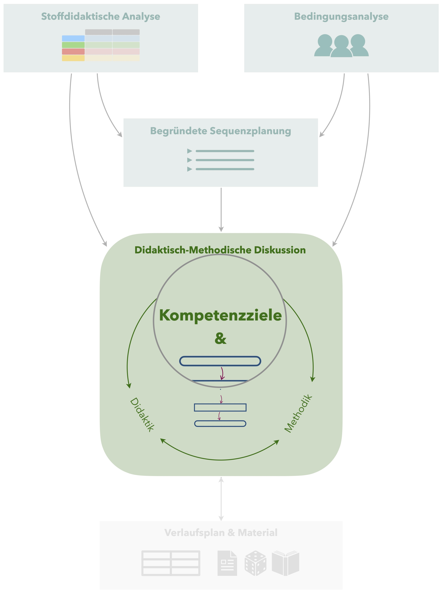

# (PART\*) Planung der Einzelstunde {.unnumbered}  

# Kompetenzziele

 Damit Sie in Ihrem Unterricht nicht einfach nur *irgendetwas* machen, ist es notwendig, eine **Zielklarheit** darüber zu haben, welche **neuen Kompetenzen die Schülerinnen und Schüler am Ende der Unterrichtsstunde erlangt** haben sollen.

## Kompetenzziele vs. Lernziele

In den fachdidaktischen Tagespraktika wird i. d. R. von *Kompetenzzielen* gesprochen, viele andere Quellen nutzen hierfür synonym auch *Lernziele*.
Gemeint sind damit die **aus Sicht der Lehrkraft verfolgten Ziele** der Unterrichtsstunde, daher wäre auch die Bezeichnung *Lehrziele* angemessen.
Es handelt sich jedoch (zunächst) **nicht um die individuellen Ziele der Schülerinnen und Schüler**, sie die in ihrem Lernprozess verfolgen.

Um eine möglichst große Passung zwischen den von der Lehrkraft verfolgten Kompetenzzielen und den individuellen Ziele der Schülerinnen und Schüler zu erreichen, ist es im Verlauf der Unterrichtsstunde von großer Bedeutung, die **Kompetenzziele den Schülerinnen und Schülern gegenüber transparent zu machen** (siehe auch Abschnitt \@ref(typische-unterrichtssituationen)). 

## Formulierung von Zielen

Um Kompetenzziele verfolgen und ihre Realisierung üerprüfen zu können, hat es sich etabliert, schlagen einige Quellen vor, die Formulierung von Zielen nach den **SMART**-Kriterien vorzunehmen [die folgenden Zitate stammen aus @Barzel2020 112]: 

* **Spezifisch:** »Die Ziele müssen konkret und spezifisch sein (damit am Ende der Stunde oder der Unterrichtseinheit klar bestimmt werden kann, ob das Ziel erreicht wurde).«

  So ist das Ziel *Die Schülerinnen und Schüler können mit Brüchen rechnen* nicht spezifisch genug, da bspw. nicht klar ist, welche Rechenoperationen durchgeführt werden können sollen oder aus welchem Zahlenmaterial die Brüche stammen sollen (Stammbrüche, gleichnamige Brüche, …). Eine spezifischere Formulierung wäre: *Die Schülerinnen und Schüler können gleichnamige Brüche mit Zählern im Zahlenraum bis 1000 ohne Hilfsmittel addieren.*
  
* **Messbar:** »Wie und durch was ist zu erkennen, dass das Ziel erreicht wird? (Indikator)«

  Wird als Ziel etwa *Die Schülerinnen und Schüler kennen den Satz des Pythagoras* formuliert, kann daraus nicht abgeleitet werden, wie dieses Ziel zu überprüfen ist. Eine messbare Formulierung wäre: *Die Schülerinnen und Schüler können den Satz des Pythagoras wiedergeben.* 
  Daher sind Formulierungen wie »kennen«, »wissen«, »verstehen« usw. zu vermeiden und dagegen messbare Beschreibungen zu bevorzugen, anhand derer die konkrete Schülerhandlung ablesbar ist (wie »beschreiben«, »erklären», »berechnen«, …)  
  
  Eine Maßnahme, die Spezifität und Messbarkeit zu erhöhen, ist die **Operationalisierung** von Kompetenzzielen. Dabei …
  Einige Quellen schlagen hierzu auch die Unterscheidung in **Grobziele** und **Feinziele** vor. Sie sollten für Ihre Unterrichtsplanung jedoch vermeiden, die Kompetenzziele zu stark aufzugliedern, damit Sie selbst einen Überblick behalten können.
  
* **Akzeptabel:** »Das Ziel muss sowohl für die Lehrer/-innen als auch für die Schüler/-innen einen Zusammenhang zu den übergeordneten Zielen aufweisen und sinnvoll erscheinen.«

  Wenn Sie Ihre Lernziele an *Kernfragen* orientieren, die sich aus der stoffdidaktischen Analyse ergeben, sollten Sie akzeptable Kompetenzziele entwickeln können. 

* **Realistisch:** »Das Ziel muss unter den gegebenen Bedingungen erreichbar sein (hierzu zählen die einzelnen Voraussetzungen der Schüler/-innen, aber auch Rahmenbedingungen wie Klassengröße, vorhandene Unterrichtszeit etc.)«

  Das Ziel *Die Schülerinnen und Schüler können den Beweis der Irrationalität von $\sqrt{2}$ selbstständig durchführen* wäre für ein 9. Klasse einer Oberschule eher als unrealistisch einzustufen, während am Gymnasium das Ziel *Die Schülerinnen und Schüler können einzelne Beweisschritte zur Irrationalität von $\sqrt{2}$ mit Unterstützung ergänzen* durchaus realistisch ist. 
  
  Es bietet sich auch an, Ziele **differenzierend zu formulieren**, also bspw. Ziele zu nennen, die alle Schülerinnen und Schüler einer Klasse erreichen sollen, während andere Ziele nur für besonders leistungsstarke oder leistungsschwächere Schülerinnne und Schüler formuliert werden könnten.  

* **Terminiert:** »Ein Zeitpunkt für die voraussichtliche Zielerreichung ist anzugeben (z. B. sind Ziele im Bereich der personalen Kompetenz langfristig zu verstehen, während ein Verfahren zur Berechnung von Nullstellen in einer Unterrichtsstunde gelernt werden kann).«

  Im Rahmen der fachdidaktischen Tagespraktika werden schwerpunktmäßig solche Ziele betrachtet, die innerhalb der jeweiligen Unterrichtsstunde erreichgt werden sollen.

Die Formulierung geeigneter Kompetenzziele fällt gerade am Anfang noch schwer. 
Folgende Vorgehensweise hat sich in bisheren Praktikumsveranstaltungen als hilfreich erwiesen:

1. Notieren Sie sich, was das **wesentlich Neue** an der Unterrichtsstude ist (Orientierung an Kernideen) und schreiben Sie auf, was die Schülerinnen und Schüler **am Ende der Unterrichtsstunde** können sollen, was sie vorher nicht konnten.
2. Überlegen Sie sich, welche **Lernhandlungen** relevant sind, um die neuen Kenntnisse, Fähigkeiten und Fertigkeiten zu erlangen bzw. auszuführen.
3. Formulieren Sie **Aufgaben mit geeigneten Operatoren**, die zum Ausführen der gewünschten Lernhandlungen anregen. 
4. Orientieren Sie sich anschließend bei der finalen Formulierung Ihrer **Kompetenzziele**  an den Antworten auf die Schritte 1 bis 3.

## Beispiel {#beispiel-kompetenzziele}

In einer Unterrichtsstunde zu Merkmalen guter Säulendiagramme wird als Ziel verfolgt:

* Die Schülerinnen und Schüler können die Merkmale guter Säulendiagramme (das Diagramm ist vollständig beschriftet, zum Diagramm existiert eine Legende; die Skalen des Diagramms sind mathematisch korrekt dargestellt) **benennen**, bei dargestellten Diagrammen **identifizieren** und beim selbstständigen Zeichnen von Diagrammen **anwenden**.

### Gegenbeispiele {- .unlisted}

Zum Kontrast sollen hier noch einige Formulierungen dargestellt werden, die keine guten Kompetenzziele beschreiben:

* »Die Schülerinnen und Schüler wissen, was gute Säulendiagramme auszeichnet.« Hierbei ist nicht **messbar**, was unter »wissen« zu verstehen ist. Außerdem ist das Ziel nicht **spezifisch** genug, da aus der Formulierung die Kriterien für gute Säulendiagramme nicht sichtbar werden.
* 

