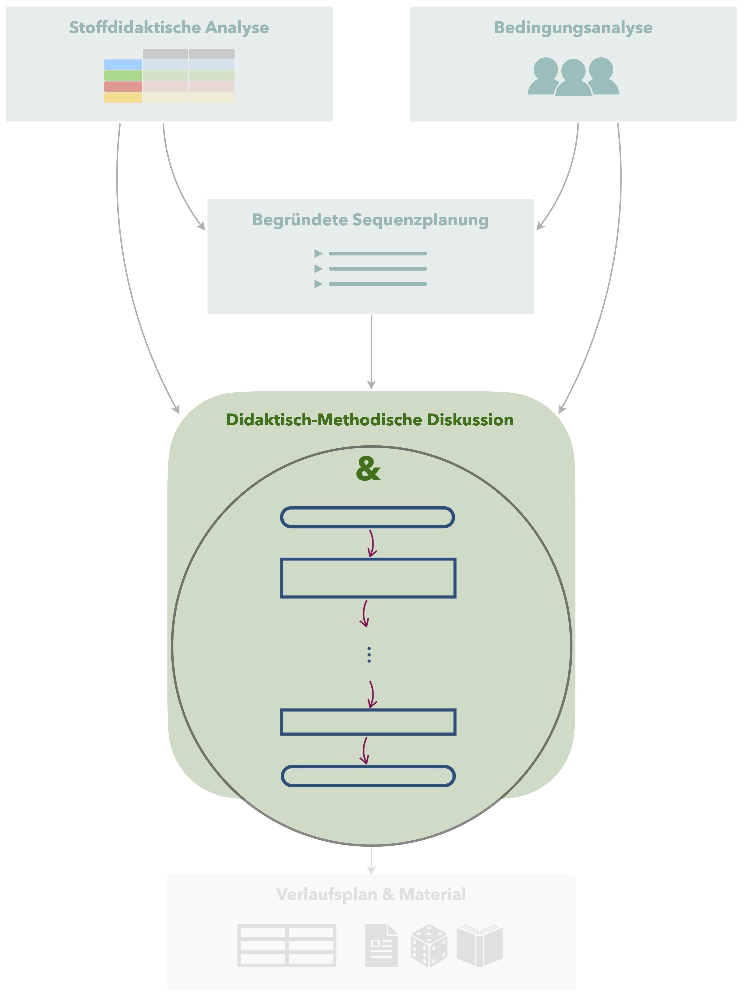
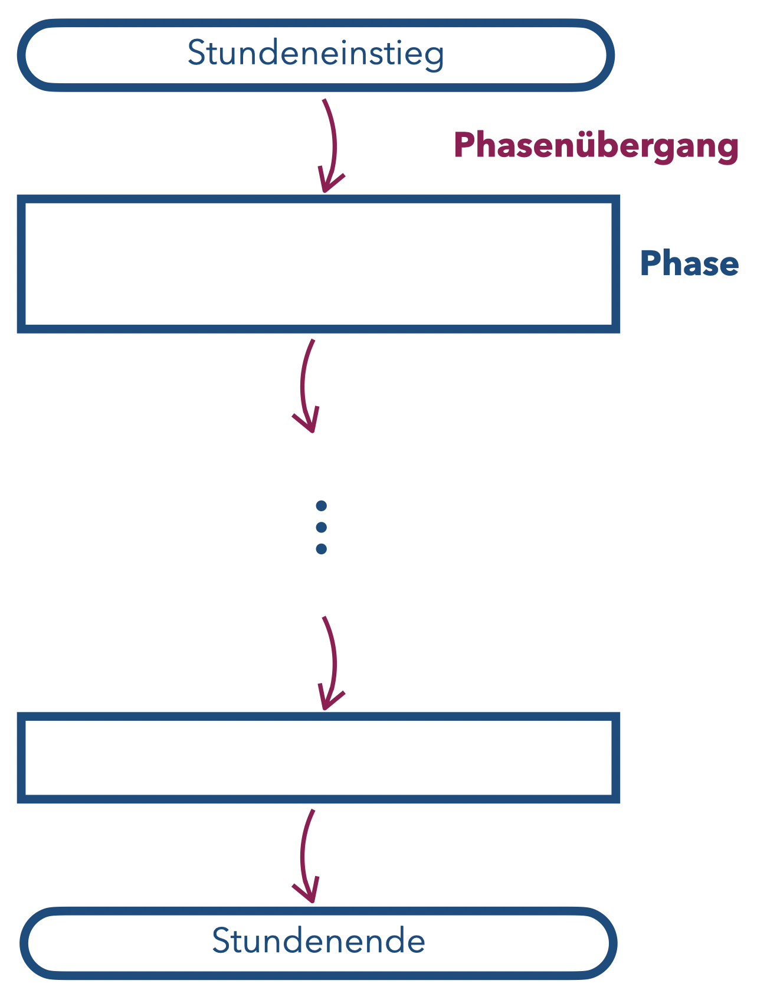
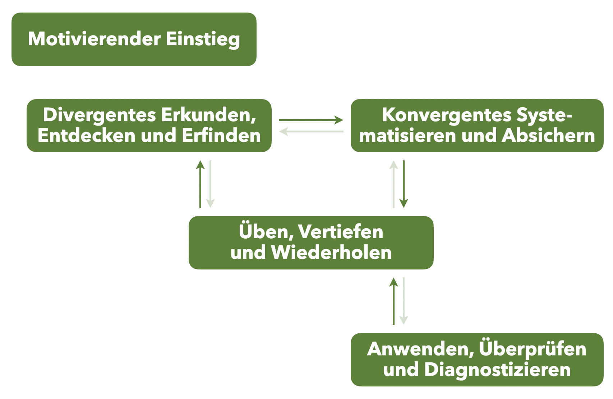

# Unterrichtsphasen


 

> **Material** (pdf-Datei)  
>
> + [Übersichten zu den verschiedenen Phasen-Modellen](files/Unterrichtsphasen.pdf)


Die konkrete Strukturierung des Unterrichts ergibt sich erst aus der didaktisch-methodischen Diskussion (siehe Kapitel \@ref(didaktisch-methodische-diskussion)). 
Dieses Kapitel dient daher eher der theoretischen Erinnerung, wie Mathematikunterricht prinzipiell strukturiert werden kann und welche **Funktion die einzelnen Unterrichtsphasen** dabei erfüllen.


## Grundsätzlicher Stundenaufbau

Die die Unterrichtsgestaltung stark von der Charakteristik der Stunde abhängt (z. B. ob ein neuer Inhalt erarbeitet wird, eine größere Übungseinheit stattfindet, verschiedene Themenbereiche miteinander vernetzt werden, …), kann man **nicht pauschal** sagen, aus wie vielen und welchen Phasen eine übliche Unterrichtsstunde besteht.

Grundsätzlich sollte jedoch **jede Unterrichtsstunde** einen (wie auch immer gearteten) **Stundeinstieg** und ein (in irgendeiner Form gestaltetes) **Stundenende** haben. 

Zusätzlich zur Gestaltung der einzelnen **Phasen** ist es weiterhin notwendig, auch die **Phasenübergänge** (Gelenkstellen) zu planen, so dass für die Schülerinnen und Schüler ein roter Faden des Unterrichtsgangs erkennbar wird.

```{r Unterrichtsphasen-grundsaetzlich, echo=FALSE, fig.cap="Grundsätzlicher Phasen-Aufbau einer Unterrichtsstunde", fig.align='center', out.width='25%'}

```


## Übersicht zu Phasenmodellen
Es bestehen vielfältige Modelle zur Phasen-Gestaltung von unterricht, die hier kurz erläutert werden. Details zu den Modellen sind den entsprechenden Quellen zu entnehmen.

* @Barzel2020 [{S. 80 ff.}] beschreiben verschiedene **Unterrichtsfuntionen** für die einzelnen Unterrichtsphasen. Das Modell fokussiert dabei die **methodische Gestaltung** des Unterrichts, was in der genannten Quelle u. a. dadurch deutlich wird, dass den verschiedenen Unterrichtfunktionen geeignete Methoden zugeordnet werden.

```{r Unterrichtsphasen-Unterrichtsfunktionen, echo=FALSE, fig.cap="Unterrichtsfunktionen nach @Barzel2020 [{S. 80 ff.}]", fig.align='center', out.width='50%'}

```


* @Bruder1991 beschreibt **tyische Unterrichtssituation**, die sich in der Phasengestaltung des Unterrichts widerspiegeln können. Dieses Modell entspringt einem **tätigkeitstheoretischen Hintergrund** und versucht damit, die erwarteten Denk- und Handlungsabläufe der Schülerinnen und Schüler durch entsprechend gestaltete Phasen zu unterstützen.

```{r Unterrichtsphasen-Unterrichtssituationen, echo=FALSE, fig.cap="Typische Unterrichtssitationen nach @Bruder1991", fig.align='center', out.width='25%'}

```


* @Prediger2015a beschreiben **Kernprozesse** für das Unterrichten. Auf das Modell soll, wegen seiner inhaltlichen Ähnlichkeit zu den andern beiden, hier nicht näher eingegangen werden. Es sei aber zu erwähnen, dass das Schulbuch *mathewerkstatt* nach diesem Modell strukturiert ist.

```{r Unterrichtsphasen-Kernprozesse, echo=FALSE, fig.cap="Kernprozesse nach @Prediger2015a", fig.align='center', out.width='25%'}

```


Zu allen Modellen muss bemerkt werden, dass die genannten Phase **nicht immer alle in jeder Unterrichtsstunde** und auch **nicht zwingend in der dargestellen Reihenfolge** erfolgen müssen. Vielmehr sollen die Modelle Unterstützung bieten, die jeweilige Phase geeignet zu gestalten, da jede Unterrichtsfunktion/typische Unterrichtssituation charakteristische Eigenschaften hat.


