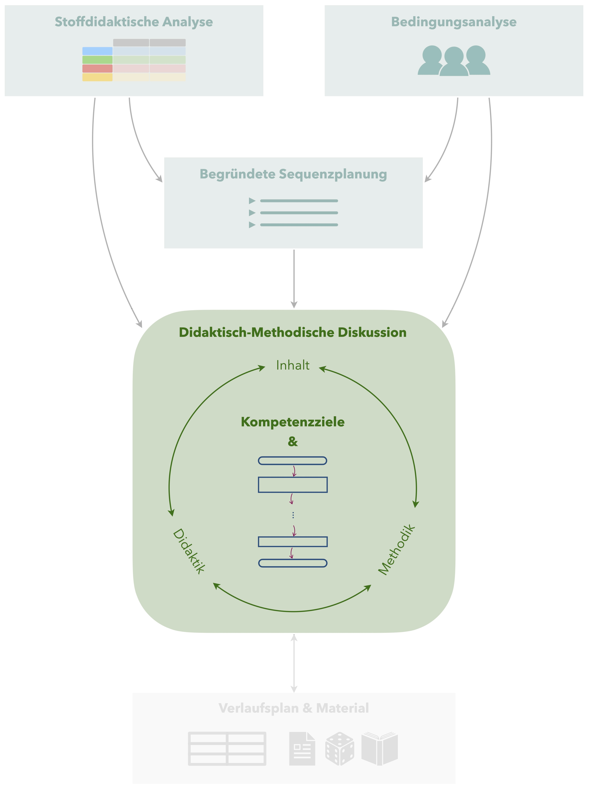

# Didaktisch-Methodische Diskussion

 Die didaktisch-methodische Diskussion stellt das Herzstück Ihrer Unterrichtsplanung dar, ist aber gleichzeitig so sehr abhängig von der jeweiligen Stundengestaltung, dass sich kaum allgemeine Hinweise geben lassen.

## Inhalt -- Didaktik -- Methodik

Prinzipiell diskutieren Sie das Zusammenspiel aus **Inhalt**, **Didaktik** und **Methodik** für Ihre Unterrichtsstunde und **begründen** damit all Ihre Planungsentscheidungen. Dies setzt voraus, dass Sie selbst über vielfältige Kenntnisse über Inhalt, Didaktik und Methodik verfügen, um diese flexibel zueinander in Bezug setzen zu können. 

Im Folgenden sind einige Impulsfragen dargestellt, die Ihnen Unterstützung bieten können, Ihre didaktisch-methodische Diskussion durchzuführen. In der tatsächlichen Planung Ihrer Unterrichtsstunde werden Sie vermutlich mehrmals Ihre Perspektive wechseln, ob Sie von den Inhalten, der Didaktik oder der Methodik ausgehend denken. Der hier dargestellte Fragenkatalog ist keinesfalls erschöpfend, sondern nur eine erste Anregung für Sie.

- Ist der mathematische Inhalt der Unterrichtsstunde ein **Begriff**, ein **Sachverhalt** oder ein **Verfahren**? Welche möglichen Konsequenzen ergeben sich daraus für die Unterrichtsgestaltung? 
- Welche **Aufgabengestaltung** bietet sich an, um die Kompetenzziele der Unterrichtsstunde zu verfolgen?
- Mithilfe welcher **Repräsentationen** vom Lerngegenstand kann der Lernprozess unterstützt werden? Welche Medien und Materialien könnten dafür eingesetzt werden?
- Welche Möglichkeiten der **Differenzierung** bestehen bei der Einführung des Themas, der Übungen oder gar der Themenauswahl?
- An welchen Stellen sollen die Schülerinnen und Schüler **Inhalte festhalten** (z. B. im Hefter), welche Vorgaben soll hierzu seitens der Lehrkraft bestehen und wie werden die Inhalte präsentiert (an Tafel, mündlich, im Schulbuch, …)?
- …

In den entsprechenden Entscheidungen spiegeln sich letztlich die Qualitätskriterien von Mathematikunterricht wider (siehe Abschnitt \@ref(qualitaetskriterien)). Mit diesen können Sie auch selbst Ihre Planung reflektieren und hinsichtlich der inhaltlichen, didaktischen und methodischen Gestaltung beurteilen. 

## Beispiel {#beispiel-didaktisch-methodische-diskussion}

***Das Beispiel wird demnächst ergänzt …***

