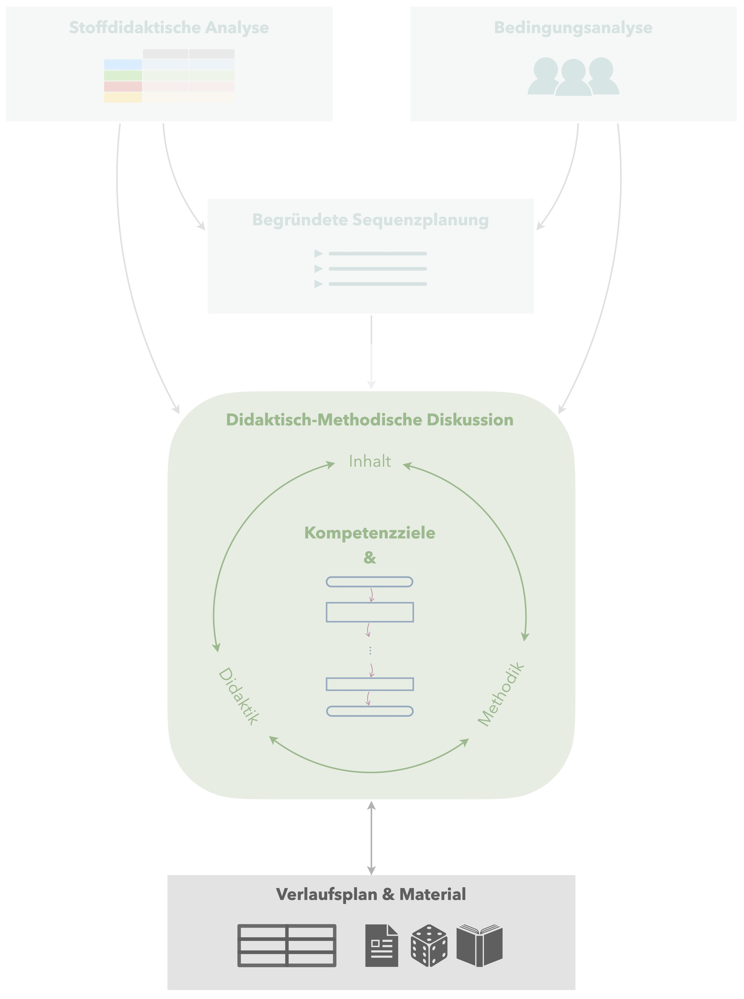

# Verlaufsplan und Material

 Als Produkt der didaktisch-methodischen Diskussion ergibt sich die vollständig durchdachte Gestaltung der Unterrichtsstunde. Um diese für die tatsächliche Durchführung des Unterrichts nutzbar und für hospitierende Personen verfügbar zu machen, ist es notwendig, wesentliche Planungsbestandteile übersichtlich darzustellen.

## Verlaufsplan

Die Struktur der Unterrichtsstunde wird schließlich in einem Verlaufsplan übersichtlich dargestellt. Hierfür bietet sich eine tabellarische Übersicht inkl. des geplanten Zeitbedarfs an, aber auch andere Darstellungen sind möglich (z. B. Flussdiagramm der Unterrichtsstruktur).

## Material

Ergänzend zum Verlaufsplan sind alle für die Unterrichtsstunde benötigten Materialien darzustellen, insbesondere das geplante **Tafelbild**, die einzusetzenden **Aufgaben inkl. ihrer Lösungen**, **Arbeitsblätter**, **Arbeitsmittel** usw. 

Auch ist es gerade für die ersten Unterrichtsstunden sinnvoll, **geeignete Impulse** explizit zu formulieren, um bspw. Phasenübergänge zu gestalten.

## Beispiel {#beispiel-verlaufsplan-und-material}

***Das Beispiel wird demnächst ergänzt …***

