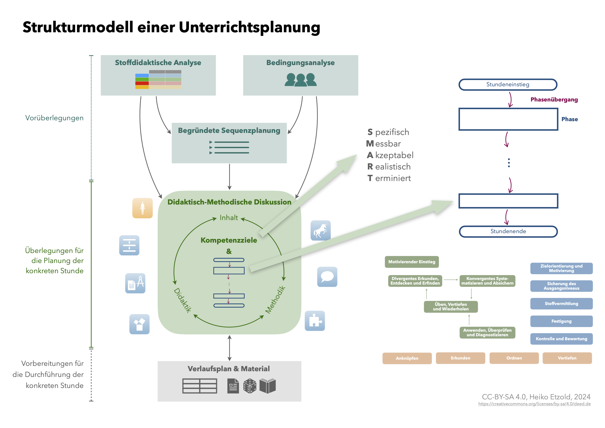
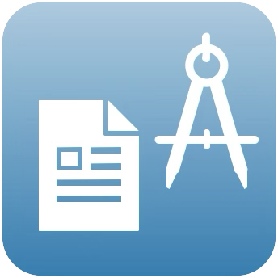

#  (APPENDIX) Anhang {-}

# Strukturmodell Unterrichtsplanung

> **Material** (pdf-Datei)  
>
> + [Strukturmodell einer Unterrichtsplanung](files/Strukturmodell-Unterrichtsplanung.pdf)


Die Abbildung fasst die in den Kapiteln \@ref(mathematikunterricht-hospitieren) bis \@ref(verlaufsplan-und-material) dargestellten Zusammenhönge noch einmal übersichtlich in einem Strukturmodell zur Unterrichtsplanung zusammen ([→ zur pdf-Datei](files/Strukturmodell-Unterrichtsplanung.pdf)).

```{r Strukturmodell-Unterrichtsplanung, echo=FALSE, fig.cap="Strukturmodell einer Unterrichtsplanung", fig.align='center', out.width='90%'}

```


# Vorbesprechung

Bevor Sie Ihre ersten Unterrichtsstunden halten, werden diese einige Tage zuvor mit der/dem Dozierenden besprochen -- einerseits, um die fachliche, fachdidaktische und pädagogische Qualität zu sichern und andererseits, um Ihnen selbst eine gewisse Sicherheit in der Durchführung Ihrer Stunde zu geben. 


* 24 Stunden vor den Vorbesprechungstermin senden Sie bitte per Mail eine kurze Übersicht (max. eine Seite) mit den **ausformulierten Kompetenzzielen**, der **groben Stundenstruktur inkl. Zeitangaben** sowie **exemplarisch drei kurze Begründungen für didaktisch-methodische Entscheidungen** unterschiedlicher Kategorien (vgl. Abschnitt \@ref(empfehlung-fuer-ftp)).  
* Zur Vorbesprechung selbst bringen Sie dann den **vollständigen Verlaufsplan** sowie **alle benötigten Materialien** mit (vgl. Kapitel \@ref(verlaufsplan-und-material)). 


<div class="beispiel">

## Beispiel für die Übersicht {.unnumbered}

### Kompetenzziele {.unnumbered}
* Die Schülerinnen und Schüler können das arithmetische Mittel einer Messreihe berechnen.
* Die Schülerinnen und Schüler können erklären, wofür man des arithmetischen Mittel benötigt.

### Grobstruktur {.unnumbered}

* **Einstieg -- 5 min**
  * Präsentation und Diskussion des Einstiegsbeispiels (Weitsprung) und Zielformulierung für Stunde
    
* **Stofferarbeitung -- 20 min**
  * Erarbeitungsaufgabe zum Einstiegsbeispiel
   * gemeinsame Verallgemeinerung und Erarbeitung der Berechnungsvorschrift  
  * Übungen zur Erstaneignung

* **Übung -- 17 min**
  * vielfältiges Üben mit differenzierenden Aufgaben

* **Zusammenfassung -- 3 min**
  * Reflexionsfragen zur Stunde mit Bezugnahme zum Stundenziel

### Ausgewählte Begründungen {.unnumbered}


* Das Einstiegsbeispiel wird als offene Aufgabe formuliert. Dies erfolgt hier konkret durch einen offenen Transfer zwischen Gegebenem und (unbekanntem) Gesuchtem, so dass mehrere Lösungsvarianten möglich sind. Dieses Vorgehen soll vielfältige Diskussionen zum Einstiegsbeispiel anregen, woraus dann das Lernziel der aktuellen Unterrichtsstunde abgeleitet wird. 

*   Bei der Erstaneignung werden Aufgaben zur Partnerarbeit zur Verfügung gestellt, bei denen die Schülerinnen und Schüler gegenseitig ihr Vorgehen zum Bestimmen des arithmetischen Mittels beschreiben. Dieses Sprechen über die eigenen Handlungen soll den Aneignungsprozess des Realisierens der Berechnung unterstützen.


* Die Aufgaben der Übungsphase sind auf verschiedenen Anforderungsniveaus gestaltet, wobei das jeweilig Niveau den Schülerinnen und Schülern durch Ampelfarben transparent gemacht wird. Die Schülerinnen und Schüler wählen daraufhin selbst aus, welche Aufgaben sie bearbeiten, wobei eine Mindestanzahl vorgegeben ist. Die Kontrolle der Aufgaben erfolgt über Lösungszettel. So soll die Selbsteinschätzung und Selbstkontrolle, v. a. in Hinblick auf die Eigenverantwortung der Schülerinnen und Schüler gestärkt werden.


</div>
