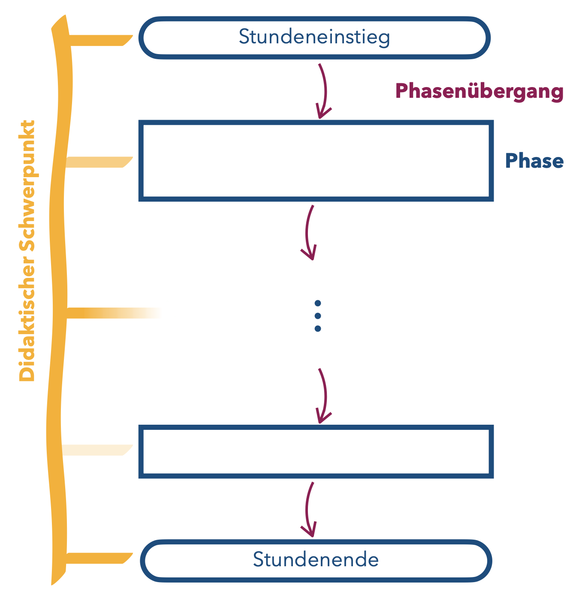

# Didaktischer Schwerpunkt

Im Land Brandenburg wird in der zweiten Phase der Lehramtsausbildung (Referendariat) die Nutzung eines didaktischen Schwerpunkts für eine Unterrichtsstunde verlangt.

Für den Mathematikunterricht hat sich dabei, aufbauend auf eine Konzeption von @Florian2020, etabliert, ein **didaktisches Prinzip als leitend für eine Unterrichtsstunde** aufzufassen. Der so gewählte didaktische Schwerpunkt soll sich in **möglichst vielen Phasen** der Unterrichtsstunde widerspiegeln.

Wenn Sie in Brandenburg Ihren Vorbereitungsdienst ablegen, werden Sie mit hoher Wahrscheinlichkeit mit didaktischen Schwerpunkten in Berührung kommen. Ansonsten ist dieses Konzept jedoch in der Mathematikdidaktik nicht verbreitet (im Gegensatz zu didaktischen Prinzipien). Daher ist die Verwendung didaktischer Schwerpunkte bei Ihrer Unterrichtsplanung in den fachdidaktischen Tagespraktika nicht verbindlich, aber durchaus möglich (und sinnvoll).

Didaktische Schwerpunkte können Ihnen als Orientierungsgrundlage dienen, da sie

- einen **Anlass** bieten, sich explizit mit **Theorie-Praxis-Bezügen** in der Unterrichtsplanung auseinanderzusetzen und  
- eine **Vielfalt an didaktischen Entscheidungen** ermöglichen, wenn sie bereits bei der Sequenzplanung Beachtung finden.

Die in Abbildung \@ref(fig:Unterrichtsphasen-grundsaetzlich) dargestellte grundsätzliche Phasierung von Unterricht kann dann entsprechend Abbildung \@ref(fig:Unterrichtsphasen-mit-Schwerpunkt) angepasst werden.


```{r Unterrichtsphasen-mit-Schwerpunkt, echo=FALSE, fig.cap="Phasen-Aufbau einer Unterrichtsstunde unter Beachtung eines didaktischen Schwerpunkts", fig.align='center', out.width='40%'}

```


